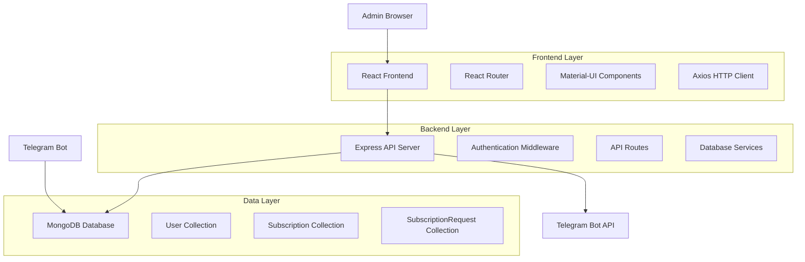

# Design Document

## Overview

The Subscription Management Web Admin Panel is a modern, responsive web application built with React.js frontend and Node.js/Express backend. It provides a comprehensive dashboard for managing Telegram bot subscriptions, integrating seamlessly with the existing MongoDB database and Telegram Bot API. The system follows a RESTful API architecture with real-time updates and secure authentication.

## Architecture

### System Architecture



### Technology Stack

**Frontend:**
- React.js 18+ with TypeScript
- Material-UI (MUI) for component library
- React Router for navigation
- Axios for HTTP requests
- Chart.js for analytics visualization
- React Query for data fetching and caching

**Backend:**
- Node.js with Express.js
- TypeScript for type safety
- JWT for authentication
- Mongoose for MongoDB integration
- Express Rate Limiting for security
- CORS for cross-origin requests

**Database:**
- MongoDB (shared with Telegram bot)
- Existing collections: Users, Subscriptions, SubscriptionRequests

## Components and Interfaces

### Frontend Components

#### 1. Authentication Components
```typescript
// LoginPage Component
interface LoginPageProps {
  onLogin: (token: string) => void;
}

// AuthProvider Context
interface AuthContextType {
  user: AdminUser | null;
  login: (username: string, password: string) => Promise<void>;
  logout: () => void;
  isAuthenticated: boolean;
}
```

#### 2. Dashboard Components
```typescript
// Dashboard Layout
interface DashboardLayoutProps {
  children: React.ReactNode;
  title: string;
}

// Pending Requests Table
interface PendingRequestsTableProps {
  requests: SubscriptionRequest[];
  onApprove: (requestId: string) => void;
  onReject: (requestId: string, reason?: string) => void;
  loading: boolean;
}

// Subscription Management Table
interface SubscriptionTableProps {
  subscriptions: Subscription[];
  onExtend: (subscriptionId: string, days: number) => void;
  onRevoke: (subscriptionId: string) => void;
  loading: boolean;
}
```

#### 3. Analytics Components
```typescript
// Analytics Dashboard
interface AnalyticsDashboardProps {
  dateRange: DateRange;
  onDateRangeChange: (range: DateRange) => void;
}

// Chart Components
interface SubscriptionChartProps {
  data: ChartData[];
  type: 'line' | 'bar' | 'pie';
}
```

### Backend API Interfaces

#### 1. Authentication Endpoints
```typescript
// POST /api/auth/login
interface LoginRequest {
  username: string;
  password: string;
}

interface LoginResponse {
  token: string;
  user: AdminUser;
}

// POST /api/auth/logout
// GET /api/auth/verify
```

#### 2. Subscription Request Endpoints
```typescript
// GET /api/requests/pending
interface PendingRequestsResponse {
  requests: SubscriptionRequest[];
  total: number;
  page: number;
  limit: number;
}

// POST /api/requests/:id/approve
interface ApproveRequestBody {
  packageType: 'daily' | 'weekly' | 'monthly';
  addToGroup?: boolean;
}

// POST /api/requests/:id/reject
interface RejectRequestBody {
  reason?: string;
}
```

#### 3. Subscription Management Endpoints
```typescript
// GET /api/subscriptions
interface SubscriptionsResponse {
  subscriptions: Subscription[];
  total: number;
  filters: SubscriptionFilters;
}

// PUT /api/subscriptions/:id/extend
interface ExtendSubscriptionBody {
  days: number;
  reason?: string;
}

// DELETE /api/subscriptions/:id
interface RevokeSubscriptionBody {
  reason?: string;
  removeFromGroup?: boolean;
}
```

## Data Models

### Extended Data Models

```typescript
// Admin User Model
interface AdminUser {
  _id: string;
  username: string;
  passwordHash: string;
  role: 'admin' | 'super_admin';
  lastLogin: Date;
  createdAt: Date;
}

// Activity Log Model
interface ActivityLog {
  _id: string;
  adminId: string;
  action: 'approve' | 'reject' | 'extend' | 'revoke' | 'login';
  targetUserId?: string;
  targetRequestId?: string;
  details: Record<string, any>;
  timestamp: Date;
}

// Analytics Data Model
interface AnalyticsData {
  date: Date;
  activeSubscriptions: number;
  newSubscriptions: number;
  expiredSubscriptions: number;
  revenue: number;
  packageBreakdown: {
    daily: number;
    weekly: number;
    monthly: number;
  };
}
```

## Error Handling

### Frontend Error Handling
```typescript
// Global Error Boundary
class ErrorBoundary extends React.Component {
  // Handle React component errors
}

// API Error Handler
interface ApiError {
  status: number;
  message: string;
  code?: string;
}

// Toast Notifications for user feedback
interface NotificationService {
  success: (message: string) => void;
  error: (message: string) => void;
  warning: (message: string) => void;
  info: (message: string) => void;
}
```

### Backend Error Handling
```typescript
// Global Error Handler Middleware
interface ErrorResponse {
  success: false;
  error: {
    message: string;
    code?: string;
    details?: any;
  };
  timestamp: string;
}

// Custom Error Classes
class ValidationError extends Error {
  statusCode = 400;
}

class AuthenticationError extends Error {
  statusCode = 401;
}

class AuthorizationError extends Error {
  statusCode = 403;
}
```

## Testing Strategy

### Frontend Testing
- **Unit Tests**: Jest + React Testing Library for components
- **Integration Tests**: API integration testing with MSW (Mock Service Worker)
- **E2E Tests**: Cypress for critical user flows
- **Accessibility Tests**: axe-core for WCAG compliance

### Backend Testing
- **Unit Tests**: Jest for individual functions and services
- **Integration Tests**: Supertest for API endpoint testing
- **Database Tests**: MongoDB Memory Server for isolated testing
- **Security Tests**: Authentication and authorization testing

### Test Coverage Goals
- Minimum 80% code coverage for both frontend and backend
- 100% coverage for critical authentication and subscription logic
- Performance testing for bulk operations

## Security Considerations

### Authentication & Authorization
- JWT tokens with short expiration (15 minutes) and refresh tokens
- Password hashing with bcrypt (minimum 12 rounds)
- Rate limiting on authentication endpoints
- Session management with secure cookies

### Data Protection
- Input validation and sanitization on all endpoints
- SQL injection prevention through Mongoose ODM
- XSS protection with Content Security Policy headers
- CORS configuration for allowed origins only

### API Security
- HTTPS enforcement in production
- API versioning for backward compatibility
- Request size limits to prevent DoS attacks
- Audit logging for all administrative actions

## Deployment Architecture

### Development Environment
```yaml
# docker-compose.dev.yml
services:
  frontend:
    build: ./frontend
    ports: ["3000:3000"]
    volumes: ["./frontend:/app"]
    
  backend:
    build: ./backend
    ports: ["5000:5000"]
    environment:
      - NODE_ENV=development
      - MONGODB_URI=mongodb://mongo:27017/telegram_bot
    
  mongo:
    image: mongo:6.0
    ports: ["27017:27017"]
```

### Production Environment
- **Frontend**: Static build deployed to CDN (Vercel/Netlify)
- **Backend**: Node.js server on cloud platform (Railway/Heroku)
- **Database**: Shared MongoDB instance with Telegram bot
- **Monitoring**: Application monitoring with logging and alerts

## Performance Optimization

### Frontend Optimization
- Code splitting with React.lazy for route-based chunks
- Memoization with React.memo and useMemo for expensive operations
- Virtual scrolling for large data tables
- Image optimization and lazy loading
- Service worker for offline functionality

### Backend Optimization
- Database indexing on frequently queried fields
- Response caching for analytics data
- Pagination for large datasets
- Connection pooling for database connections
- Compression middleware for API responses

### Real-time Updates
- WebSocket connection for real-time dashboard updates
- Server-Sent Events for notifications
- Optimistic updates in frontend for better UX
- Background sync for offline operations