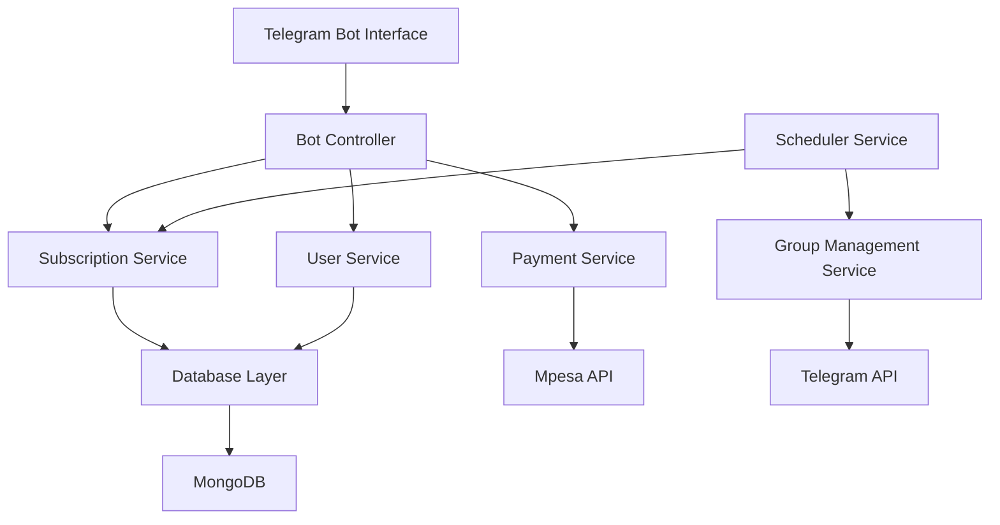

# Design Document

## Overview

The Telegram Purchase and Authenticator Bot is a Node.js application that integrates Telegram Bot API with Mpesa payment processing to manage subscription-based access to private Telegram groups. The system handles user registration, payment processing, subscription management, and automated group membership control.

The bot operates as a stateful service that maintains user subscription data in MongoDB and processes payments through Safaricom's Mpesa API. It provides a conversational interface for users to purchase subscriptions and automatically manages group access based on subscription status.

## Architecture

The system follows a modular architecture with clear separation of concerns:



### Core Components:

1. **Bot Controller**: Handles Telegram webhook events and user interactions
2. **Subscription Service**: Manages subscription lifecycle and expiration logic
3. **Payment Service**: Processes Mpesa payments and transaction verification
4. **User Service**: Manages user data and authentication state
5. **Group Management Service**: Handles adding/removing users from Telegram groups
6. **Scheduler Service**: Manages background tasks for subscription expiration checks

## Components and Interfaces

### Bot Controller
```javascript
class BotController {
  handleStart(ctx)           // Welcome message and subscription options
  handleSubscription(ctx)    // Process subscription selection
  handlePayment(ctx)         // Initiate payment flow
  handleRenewal(ctx)         // Handle subscription renewal
  handleStatus(ctx)          // Show current subscription status
}
```

### Subscription Service
```javascript
class SubscriptionService {
  createSubscription(userId, packageType, transactionId)
  getSubscription(userId)
  renewSubscription(userId, packageType, transactionId)
  checkExpiration(userId)
  expireSubscription(userId)
  getExpiringSubscriptions()
}
```

### Payment Service
```javascript
class PaymentService {
  initiatePayment(phoneNumber, amount, accountReference)
  verifyTransaction(transactionId)
  processCallback(callbackData)
  getTransactionStatus(transactionId)
}
```

### User Service
```javascript
class UserService {
  createUser(telegramId, username, phoneNumber)
  getUser(telegramId)
  updateUser(telegramId, updates)
  getUserSubscriptionStatus(telegramId)
}
```

### Group Management Service
```javascript
class GroupManagementService {
  addUserToGroup(userId)
  removeUserFromGroup(userId)
  checkUserInGroup(userId)
  validateGroupAccess(userId)
}
```

## Data Models

### User Model
```javascript
{
  _id: ObjectId,
  telegramId: Number,
  username: String,
  phoneNumber: String,
  createdAt: Date,
  updatedAt: Date
}
```

### Subscription Model
```javascript
{
  _id: ObjectId,
  userId: ObjectId,
  packageType: String, // 'daily', 'weekly', 'monthly'
  startDate: Date,
  endDate: Date,
  status: String, // 'active', 'expired', 'cancelled'
  transactionId: String,
  amount: Number,
  createdAt: Date,
  updatedAt: Date
}
```

### Transaction Model
```javascript
{
  _id: ObjectId,
  userId: ObjectId,
  transactionId: String,
  mpesaReceiptNumber: String,
  phoneNumber: String,
  amount: Number,
  status: String, // 'pending', 'completed', 'failed'
  packageType: String,
  createdAt: Date,
  completedAt: Date
}
```

### Configuration Model (Environment Variables)
```javascript
{
  BOT_TOKEN: String,
  GROUP_ID: String,
  MONGO_URI: String,
  SAFARICOM_CONSUMER_KEY: String,
  SAFARICOM_CONSUMER_SECRET: String,
  MPESA_BASE_URL: String,
  BUSINESS_SHORT_CODE: String,
  PASS_KEY: String,
  CALLBACK_URL: String,
  PORT: Number,
  DAILY_PRICE: Number,
  WEEKLY_PRICE: Number,
  MONTHLY_PRICE: Number
}
```

## Error Handling

### Payment Errors
- **Mpesa API Unavailable**: Retry mechanism with exponential backoff
- **Invalid Phone Number**: User-friendly validation messages
- **Insufficient Funds**: Clear error message with retry option
- **Transaction Timeout**: Automatic status checking and user notification

### Telegram API Errors
- **Bot Blocked**: Log error and mark user as inactive
- **Group Access Denied**: Admin notification and error logging
- **Rate Limiting**: Queue management and retry logic
- **Network Errors**: Retry mechanism with circuit breaker pattern

### Database Errors
- **Connection Loss**: Automatic reconnection with connection pooling
- **Validation Errors**: User-friendly error messages
- **Duplicate Transactions**: Idempotency checks and conflict resolution

### Error Response Format
```javascript
{
  success: false,
  error: {
    code: 'PAYMENT_FAILED',
    message: 'Payment could not be processed. Please try again.',
    details: 'Mpesa transaction timeout',
    timestamp: '2025-01-22T10:30:00Z'
  }
}
```

## Testing Strategy

### Unit Testing
- **Service Layer**: Mock external dependencies (Mpesa API, Telegram API, Database)
- **Business Logic**: Test subscription calculations, expiration logic, payment validation
- **Data Models**: Validate schema constraints and data integrity
- **Utilities**: Test helper functions and data transformations

### Integration Testing
- **Database Operations**: Test CRUD operations with test database
- **External APIs**: Test with Mpesa sandbox environment
- **Bot Interactions**: Test conversation flows with Telegram Bot API test environment
- **Payment Flow**: End-to-end payment processing with mock transactions

### End-to-End Testing
- **User Journey**: Complete subscription purchase flow
- **Renewal Process**: Subscription renewal and group re-access
- **Expiration Handling**: Automatic removal and notification flow
- **Error Scenarios**: Payment failures, API timeouts, network issues

### Test Environment Setup
```javascript
// Test configuration
{
  MONGO_URI: 'mongodb://localhost:27017/telegram_bot_test',
  MPESA_BASE_URL: 'https://sandbox.safaricom.co.ke',
  BOT_TOKEN: 'test_bot_token',
  GROUP_ID: 'test_group_id'
}
```

### Testing Tools
- **Jest**: Unit and integration testing framework
- **Supertest**: HTTP endpoint testing
- **MongoDB Memory Server**: In-memory database for testing
- **Nock**: HTTP request mocking for external APIs
- **Telegraf Test**: Telegram bot conversation testing